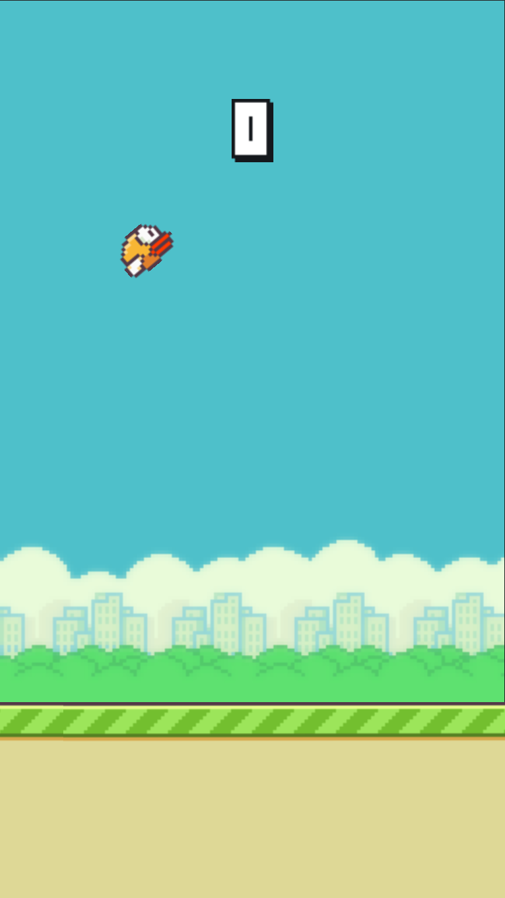
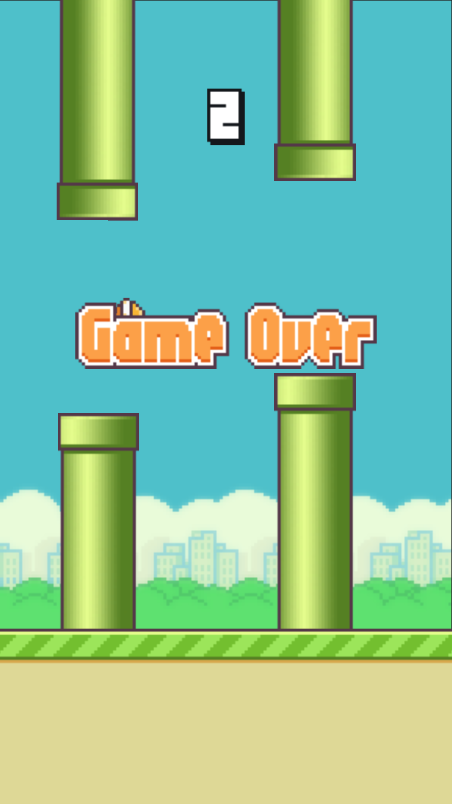

# SpriteKit Flappy Bird

A SpriteKit rewrite of the world-famous Flappy Bird.

### Comments
The project uses a "GameObject" protocol that allows SKScene to forward some of its callbacks to conforming children.
Ex. `SKScene.update()` calls `update()` on all of its children.

In a larger project I might have made GameObject a word-for-word copy of all SKScene callbacks. Here, it only has 3 functions - `setUp()`, `update()` and `changeState(to:)`.

Because this game really only takes place in one scene, I ended up using a GameState enum to keep track of which nodes are visible.
In a "real" project, each of these states would have been their own scene instead (menu, playing, game over, settings, etc) meaning fewer nodes and state logic in any one scene.

While the gameplay works great, there's an occasional bug with audio. `SKAction.playSoundFileNamed(_:waitForCompletion:)` was designed for simple sound effects. Sadly in practice I got unreliable results. Apparently other developers have been encountering this issue for years. A real project might use SKAudioNode or AVPlayer.

Lastly, I don't have every asset from the original game. So no pause buttton or fancy medals after a game over.

### Previews

  
   

### Disclaimer
This application was written for educational purposes under Fair Use. I don't own Flappy Bird or any of its art and audio assets.
